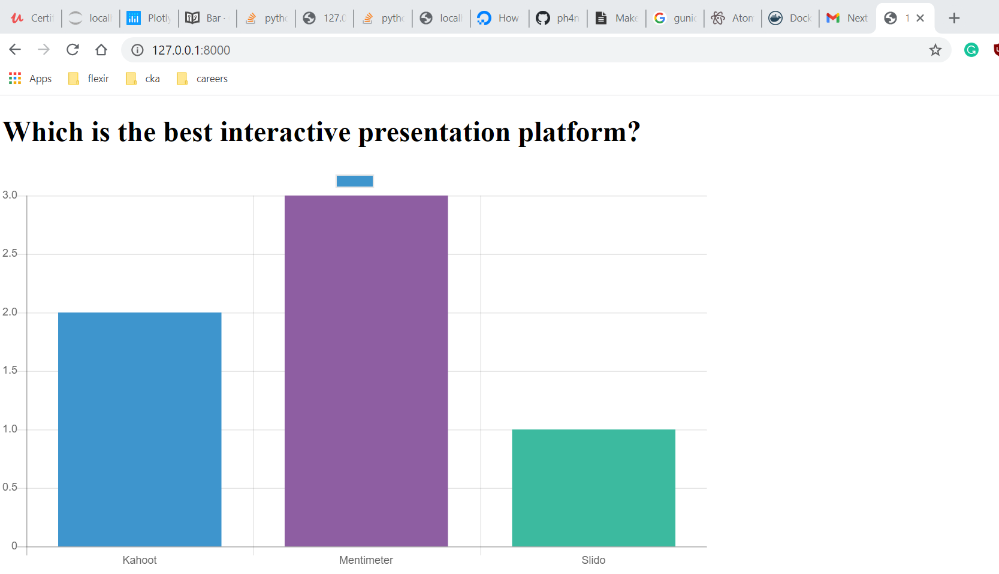

# Test Mentimeter

This is a solution for the case-DevOps assignment.

## Usage 

To run this script as a python script, clone this repo and run the following while being in the repo directory 
```bash
pip install django 
pip install requests 

python manage.py runserver 
```

To run this script as a docker container, clone this repo and run the following while being in the repo directory 

```python
docker build -t mydjango . 

docker run --name app -p 8000:8000 pavangunda66/mydjango

```

To run this script in the Kubernetes cluster and be HA

```python
kubectl apply -f Deployment.yml

kubectl apply -f Service.yml

```
and browse <ip-address>:8000 or localhost:8000
## To-dos for being prod ready 

1: should use Nginx or Gunicorn as the webserver.



